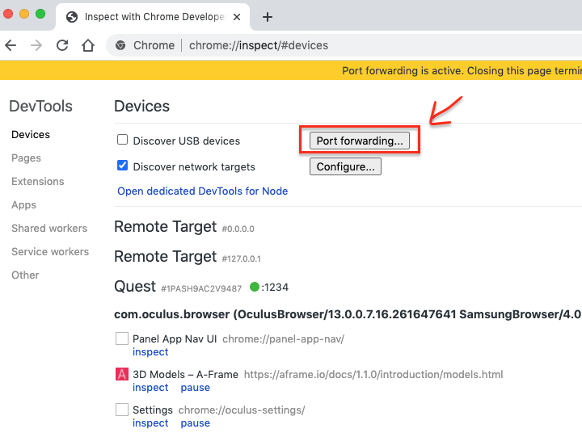
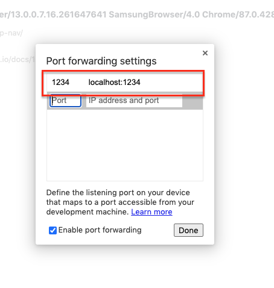

Boilerplate repository for locally developing WebXR applications with Aframe and Svelte in Typescript.

## Setup

Clone the code, run `npm install`. In `src/` theres a dummy placeholder TS file that can be used as starting point.

If you want to run the application on the Oculus Quest you need to enable that first, see below how to do so.

## Commands

Start the development server with `npm run dev`. This builds everything and starts a hot reloading HTTP server on port 5000.

Create a build with `npm run build`.

## Testing / Previewing on Oculus Quest

WebXR normally requires HTTPS, but not on localhost. We can use Chrome's port forwarding to easily access the development server on your development computer from the Quest.

### Enabling USB Debugging on Oculus Quest

Follow this instructions
https://developer.oculus.com/documentation/oculus-browser/browser-remote-debugging/
to enable USB debugging on Oculus Quest.

Note: the linked android platform tools in the above documentation are only for windows, you find the
ones for other operating systems here https://developer.android.com/studio/releases/platform-tools

### Port forwarding the development server

Open chrome, navigate to chrome://inspect/#devices.

Click on "Port forwarding".

In the dialogue, enter **5000** for _Port_ and **localhost:5000** for _IP address and port_

Ensure **Enable port forwarding** is checked.

Now, on your Quest, enter **http://localhost:5000** into the browser and see the nice things you have developed.

#### Live Reloading
To enable live reloading the development server on the Quest, you need to forward port **35729** as well.

